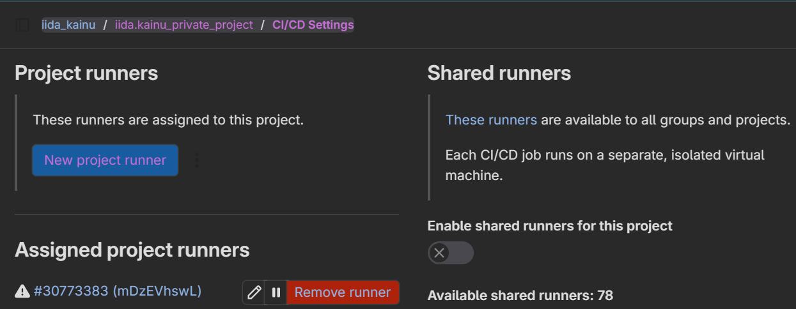

# Project Document

## Instructions for the Teaching Assistant

### Implemented Optional Features

### Instructions for Examiner to Test the System

## Description of the CI/CD Pipeline

Briefly document all steps:
• Version management; use of branches etc
• Building tools
• Testing; tools and test cases
• Packing
• Deployment
• Operating; monitoring

## Example Runs of the CI/CD Pipeline

## Reflections

### Main Learnings and difficulties

**Especially, if you think that something should have been done differently, describe it here.**

#### Difficulties

I had trouble with the course-provided GitLab instance due to the self-signed certificate. Thus, I decided not to use it and, instead, utilized GitLab's free trial and created a repository there. For clarification, I still registered my own GitLab runner and disabled shared runners for the project, as seen in the next picture.


### Amount of Effort Used

Estimation of used hours: ~4h

## Commands for Docker Runner (self-reference)

Starting the container:

```sh
docker volume create gitlab-runner-config
docker run -d --name gitlab-runner --restart always -v /var/run/docker.sock:/var/run/docker.sock -v gitlab-runner-config:/etc/gitlab-runner gitlab/gitlab-runner:latest
```

Registering the runner:

```sh
docker run --rm -it -v gitlab-runner-config:/etc/gitlab-runner gitlab/gitlab-runner:latest register
```

Docker-out-of-Docker (DooD) by exposing the Docker socket to the CI container (created containers are sibling containers):

```sh
docker run -v /var/run/docker.sock:/var/run/docker.sock ...
```

Verifying the instance:

```sh
docker exec gitlab-runner /bin/sh -c "gitlab-runner verify"
```
