# Project Document

## Instructions for the Teaching Assistant

### Running the System

The system may be tested with `docker-compose up --build`. When testing the PUT /state endpoint, please use the ”Content-Type: text/plain” -header.

### Running tests

The tests may be run locally. First, start a RabbitMQ container:

```sh
docker run -d --hostname rabbitmq-iida --name rabbitmq-iida -p 5672:5672 rabbitmq:3.10
```

Then navigate to api-gateway folder, install dependencies and run the tests:

```sh
cd api-gateway && npm install && npm run test && cd ..
```

Then navigate to monitor folder, install dependencies and run the tests:

```sh
cd monitor && npm install && npm run test && cd ..
```

## Implemented Optional Features

### Implement a Static Analysis Step in the Pipeline

Static analysis step is included as part of the build phase of the pipeline. Used tools include pylint and eslint.

### Deployment to an External Cloud

The project is deployed to an AWS EC2 instance in the deploy phase of the pipeline. See chapter [deployment](#deployment) for further details.

## Description of the CI/CD Pipeline

The CI/CD pipeline consists of three phases: build, test, deploy. The CI/CD pipeline is run automatically triggered by changes being pushed to "project" branch. In other words, the pipeline is run each time "project" branch is pushed to.

### Building Tools

Build-phase consists of format-checking, linting, and building (excluded for service2, which is written in python) the three services. For nodejs services, the used tools include prettier (format-checking), eslint (linting), and tsc (compliling TypeScript). For the python service, black (format-checking) and pylint (linting) are utilized.

### Testing; Tools and Test Cases

Jest is used as the testing tool. At least one test per API call is created (occasionally a few more per API call for a sanity-check). Tests for new features are implemented in test-driven manner. The tests implemented to be more like unit tests rather than integration tests; only RabbitMQ container is required to run the tests. Since the API gateway forwards GET /messages requests to the monitor, that endpoint is tested as part of the monitor unit tests.

Since the tests are unit tests, **a separate "tests" folder is not created**. Instead, the tests can be found at `./api-gateway/src/index.test.ts` and `./api-gateway/src/index.test.ts`.

#### Test Cases

API Gateway unit tests:

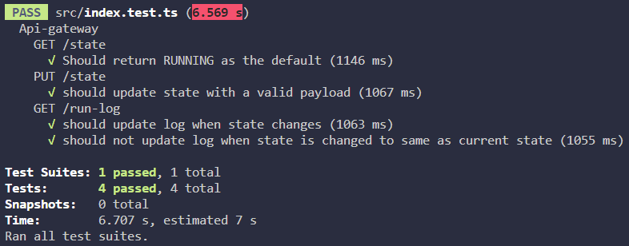

Monitor unit tests

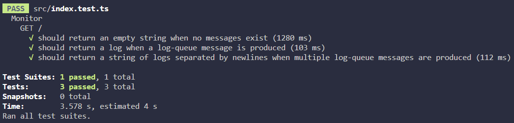

### Deployment

The project is deployed to an AWS EC2 instance, which is connected to with SSH. First, any existing project repository -folder is deleted. Second, the project repository is cloned with SSH. Third, the container is started with docker-compose up -d --build. See chapter [Example Runs of the Pipeline](#example-runs-of-the-pipeline) for a successful deployment example to the EC2 instance.

## Example Runs of the Pipeline

### Successful Run

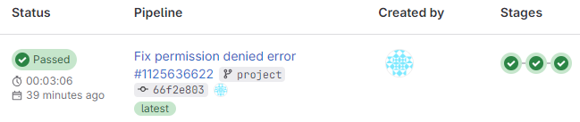
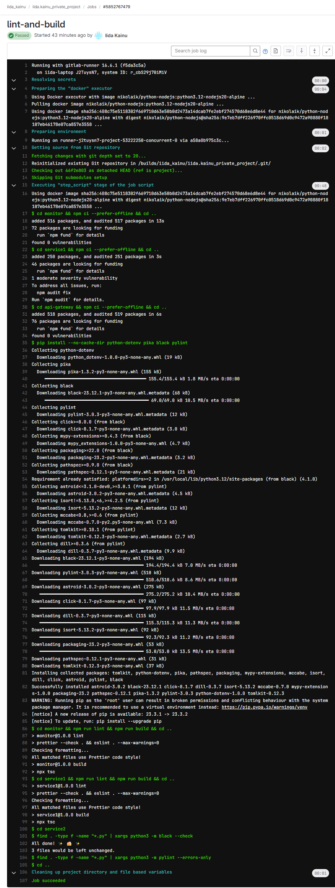
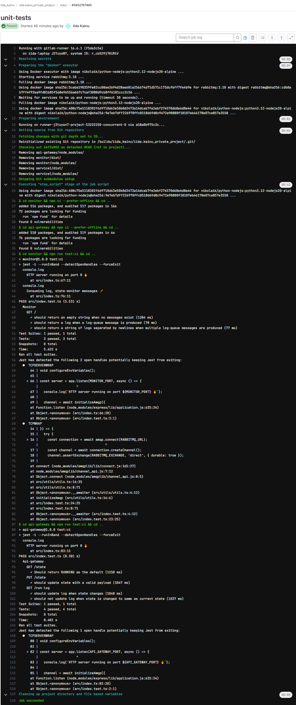
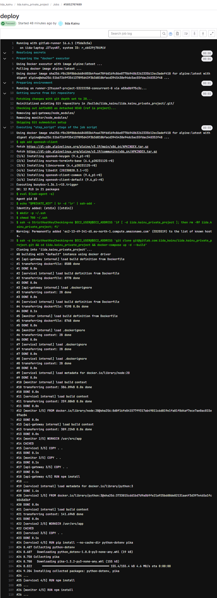
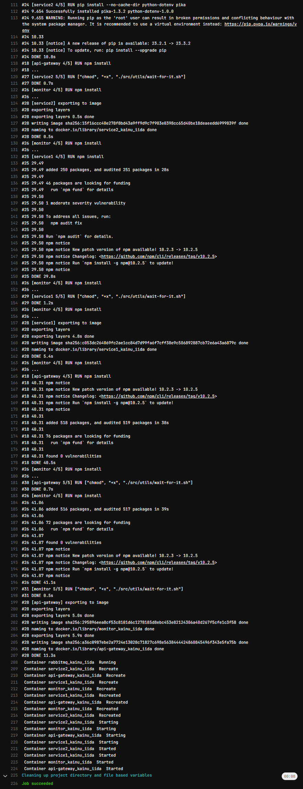

### Failed Run

Only the failing phase is shown, since the passing build phase is similar to what is shown in the successful run. Tests failed due to forgetting to set a env variable. The deploy phase is skipped, since a previous phase failed.

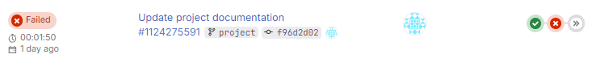
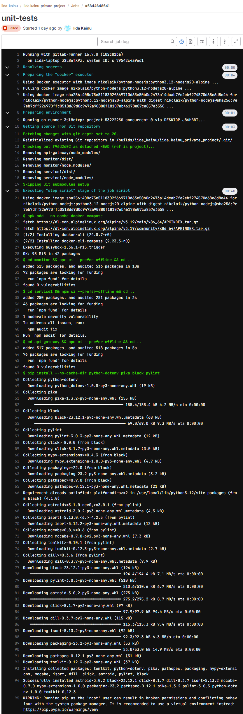
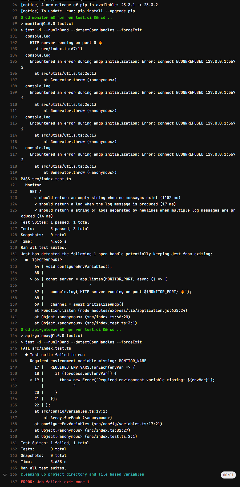

## Reflections

### Main Learnings and Difficulties

My main learnings include using a self-managed GitLab runner, using another container in CI/CD pipeline (GitLab CI/CD services), and new-to-me linux commands. I was already familiar with writing GitLab CI/CD pipelines.

#### Improvement Reflections

A lot of utility code (wait-for-it.sh, rabbitMQ related functions) are duplicated across the different components (api-gateway, monitor, service1). Thus, a monorepo-structure (where utility code is defined once and usable by all components) would have suited the project better.

#### Difficulties

##### Course-provided GitLab

I had trouble with the course-provided GitLab instance (could not push code to the repository), possibly due to the self-signed certificate. Thus, I decided not to use it and, instead, utilized GitLab's free trial and created a repository there. For clarification, I still registered my own GitLab runner and disabled shared runners for the project, as seen in the next picture.

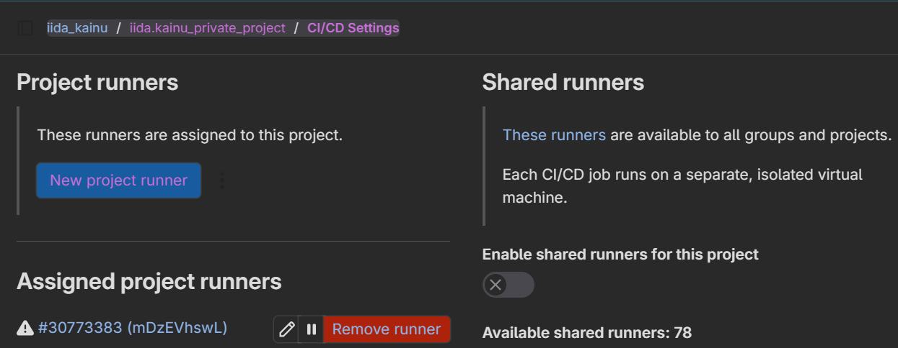

##### Docker-in-Docker

I had a difficult time trying to get Docker-in-Docker working in the CI/CD pipeline. At some point I got DinD successfully running in the deploy phase (`docker-compose up --build`), but it seemed to be flaky. Since I needed RabbitMQ for the test-phase of the pipeline, I struggled with a solution for many hours. At some point I discovered the existance of [GitLab Services](https://docs.gitlab.com/ee/ci/services/), which solved my issues in the test-phase of the pipeline.

### Amount of Effort Used

Estimation of used hours: ~26h. The estimation does not include parts of the project that were already impelemented in previous exercises.
